# LibTokaMap Component Relationships

This document provides detailed relationship diagrams and interaction patterns between components in the LibTokaMap library.

## Core Component Relationships

### 1. High-Level System Architecture

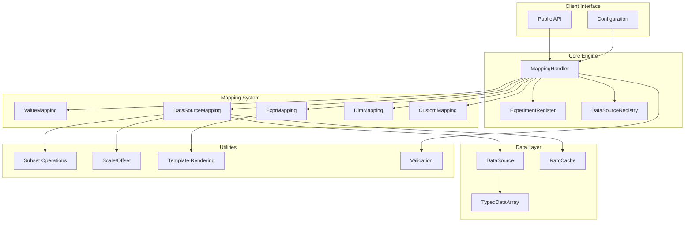

### 2. Mapping Handler Dependencies

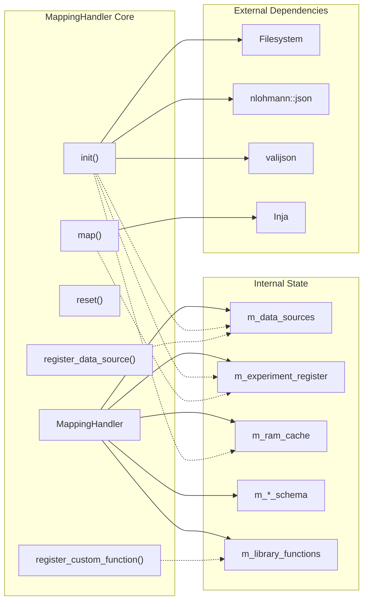

### 3. Data Flow Through Mapping Types

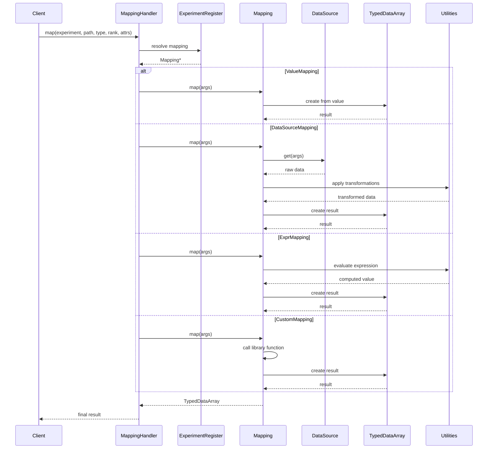

## Detailed Component Interactions

### 1. TypedDataArray Lifecycle

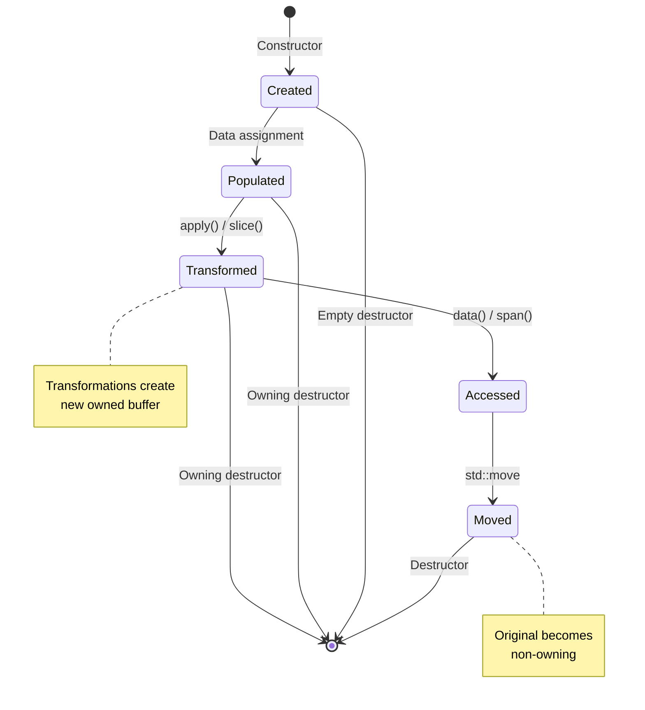

### 2. Experiment Loading Process

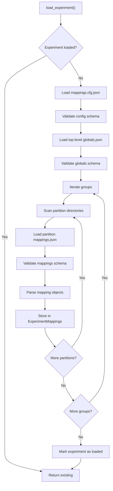

### 3. Data Source Integration Pattern

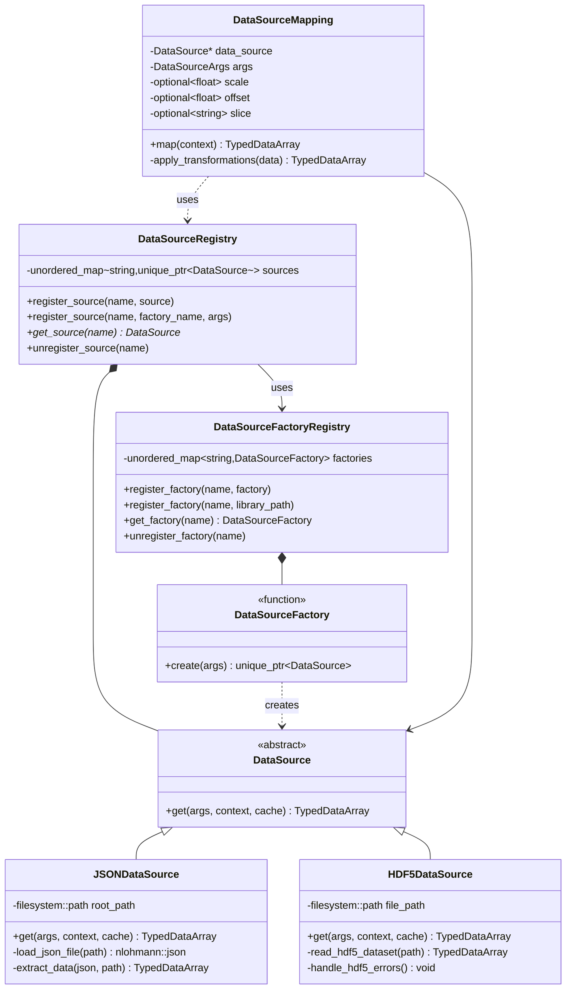

### 4. Cache Integration

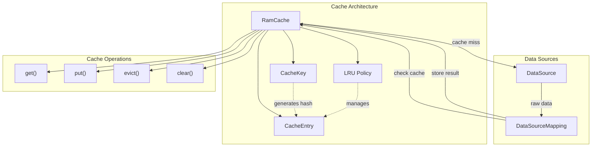

## Cross-Component Communication Patterns

### 1. Observer Pattern for Cache Events

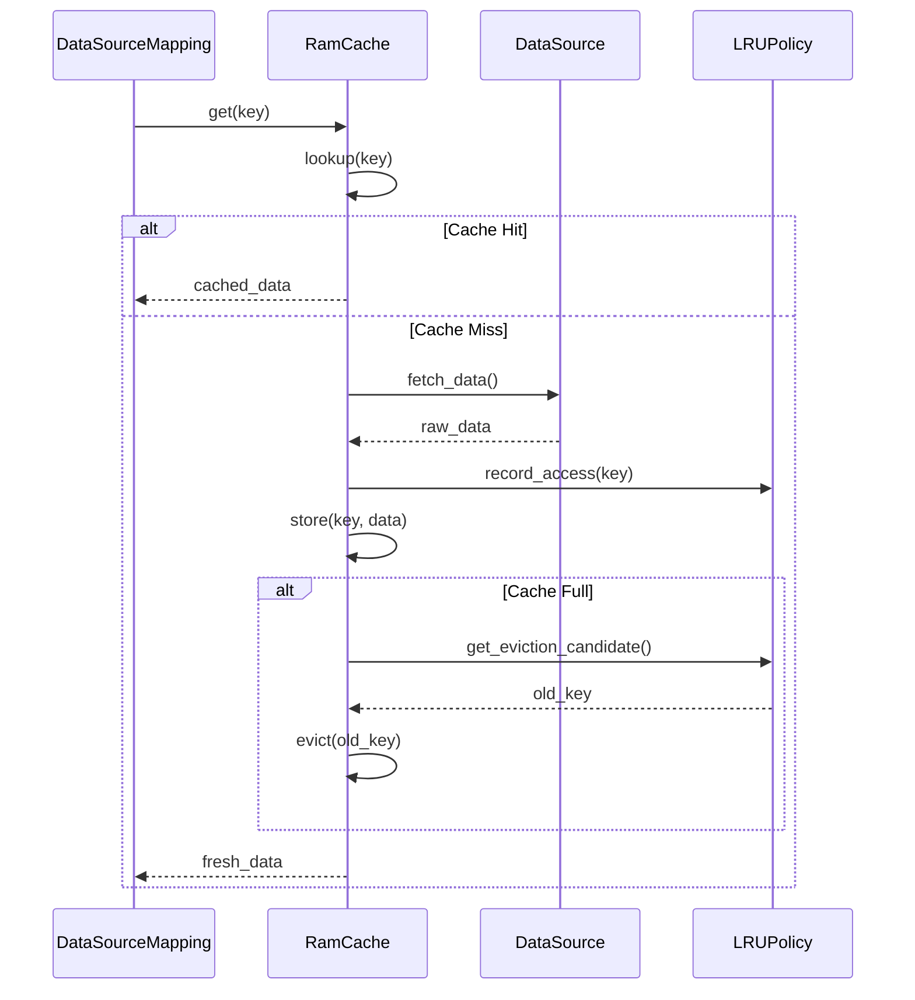

### 2. Template Resolution Chain

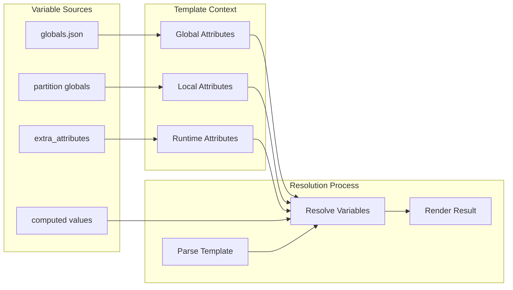

### 3. Error Propagation Chain

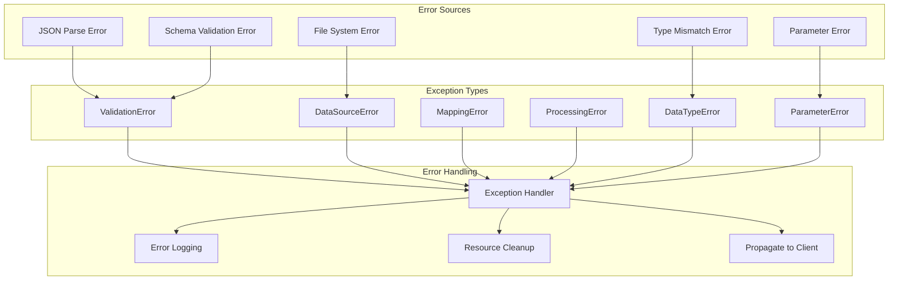

## Resource Management Patterns

### 1. Memory Ownership Model

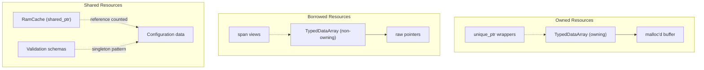

### 2. Library Loading Lifecycle

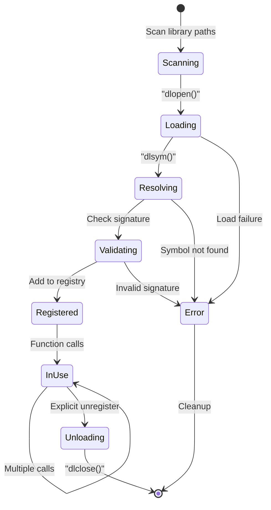

### 3. Configuration Validation Pipeline

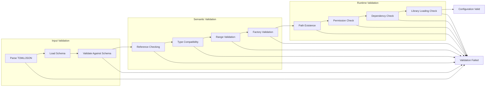

## Enhanced Subset Operations

### 4. Advanced Slicing Architecture

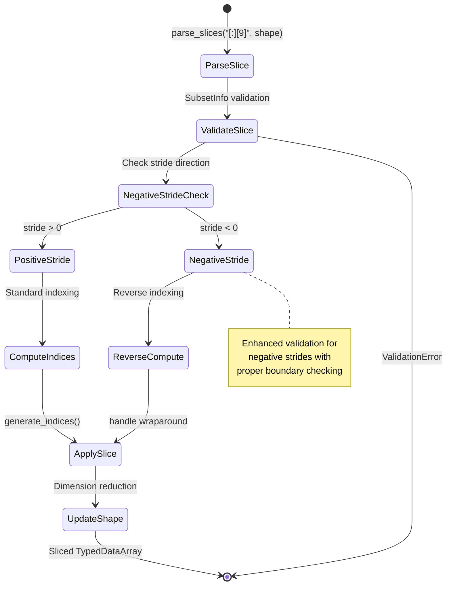

### 5. Factory Loading Lifecycle

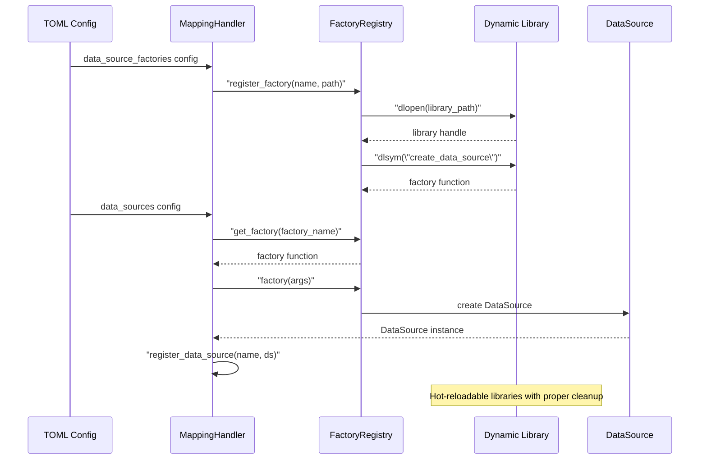

This component relationship documentation provides a comprehensive view of how different parts of LibTokaMap interact, including the new factory pattern and enhanced subset operations, making it easier to understand the system for maintenance, debugging, and refactoring purposes.
