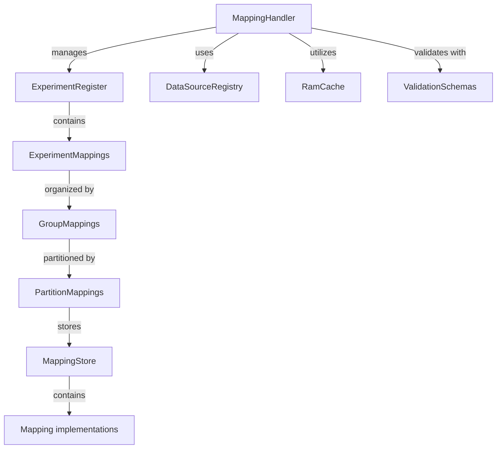
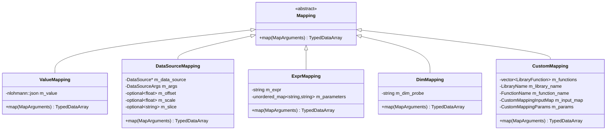
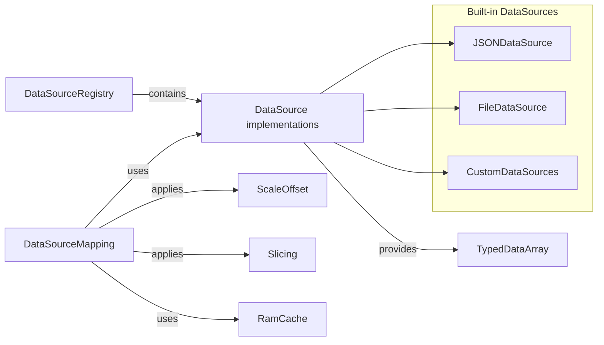
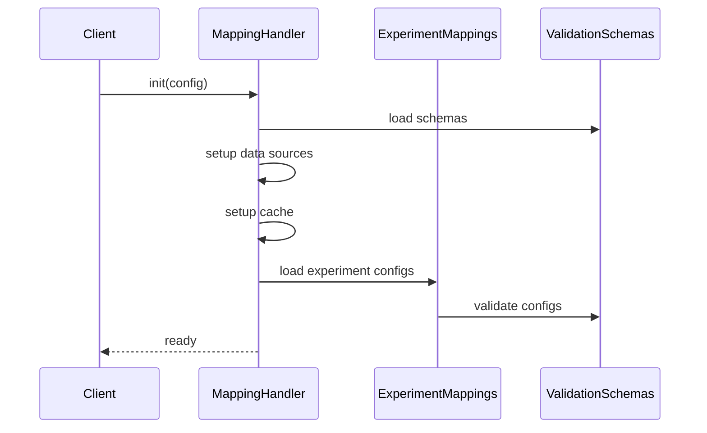
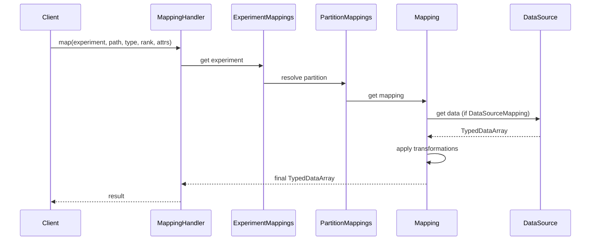
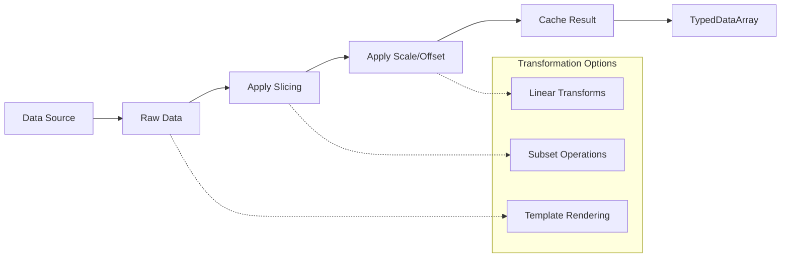
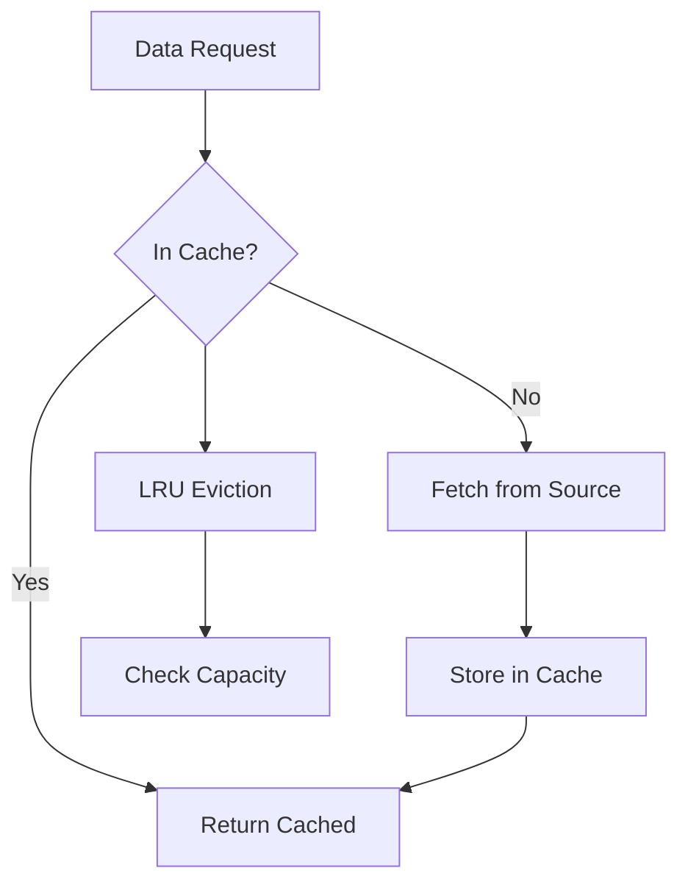
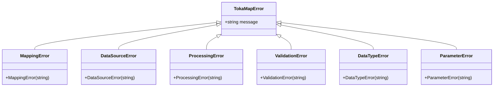

# LibTokaMap Knowledge Graph

## Overview

This knowledge graph captures the architectural components, relationships, and data flow patterns within the LibTokaMap library. It serves as a comprehensive reference for understanding the system architecture and planning refactoring efforts.

## Core Architecture

### 1. Main Components



### 2. Mapping Type Hierarchy



### 3. Data Source Architecture



## Data Structures and Types

### 1. Core Data Types

| Type | Purpose | Key Features |
|------|---------|--------------|
| `TypedDataArray` | Type-safe data container | Move-only, templated access, shape awareness |
| `MapArguments` | Context for mapping operations | Contains global data, entries, data type, rank |
| `DataType` | Enumeration of supported types | Maps to C++ fundamental types |
| `SubsetInfo` | Slice specification | Start, stop, stride with validation |

### 2. Configuration Types

| Type | Purpose | Structure |
|------|---------|-----------|
| `ExperimentMappings` | Experiment configuration | Partition list, groups, mappings, globals |
| `MappingPartition` | Directory selection logic | Attribute name, selector strategy |
| `DirectorySelector` | Partition selection strategy | MaxBelow, MinAbove, Exact, Closest |

### 3. JSON Schema Integration

```yaml
Schemas:
  - mappings.schema.json: Validates mapping definitions
  - globals.schema.json: Validates global variable files
  - mappings.cfg.schema.json: Validates experiment configuration

Validation Flow:
  JSON Input → Schema Validation → Object Creation → Runtime Usage
```

## Data Flow and Processing Pipeline

### 1. Initialization Flow



### 2. Mapping Resolution Flow



### 3. Data Transformation Pipeline



## Directory Structure and Organization

### 1. Project Layout

```
libtokamap/
├── include/           # Public headers
├── src/              # Implementation
│   ├── handlers/     # MappingHandler
│   ├── map_types/    # Mapping implementations
│   ├── utils/        # Utilities and helpers
│   └── exceptions/   # Exception types
├── examples/         # Usage examples
├── test/            # Unit tests
├── schemas/         # JSON schemas
└── docs/           # Documentation
```

### 2. Mapping Directory Structure

```
mappings/
├── experiment1/
│   ├── mappings.cfg.json      # Experiment configuration
│   ├── globals.json           # Top-level globals
│   └── group_name/
│       └── partition_value/
│           ├── globals.json   # Partition globals
│           └── mappings.json  # Actual mappings
```

## Key Algorithms and Utilities

### 1. Subset Operations

| Operation | Description | Example |
|-----------|-------------|---------|
| Basic slice | `[start:stop:stride]` | `[0:10:2]` |
| Negative indexing | From end of array | `[-5:-1]` |
| Multi-dimensional | Per-dimension slicing | `[[0:5], [::2]]` |

### 2. Template Rendering (Inja)

- Global variable substitution
- Expression evaluation in mapping definitions
- Dynamic path construction

### 3. Caching Strategy



## Extension Points and Plugin Architecture

### 1. Custom Data Sources

```cpp
class CustomDataSource : public DataSource {
public:
    TypedDataArray get(const DataSourceArgs& args,
                      const MapArguments& arguments,
                      RamCache* cache) override;
};

// Registration
mapping_handler.register_data_source("MY_SOURCE", 
    std::make_unique<CustomDataSource>());
```

### 2. Custom Mapping Functions

```cpp
// External library function signature
extern "C" TypedDataArray my_custom_function(
    const CustomMappingInputMap& inputs,
    const CustomMappingParams& params);

// Dynamic loading and registration
LibraryFunction func = load_library_function("path/to/lib.so", 
                                           "my_custom_function");
mapping_handler.register_custom_function(func);
```

## Error Handling and Exception Hierarchy



## Dependencies and External Libraries

### 1. Core Dependencies

| Library | Purpose | Usage |
|---------|---------|--------|
| nlohmann/json | JSON parsing | Configuration, data exchange |
| Pantor/Inja | Template engine | Dynamic content generation |
| ExprTk | Expression parsing | Mathematical expressions |
| valijson | JSON validation | Schema validation |

### 2. Build System Integration

- CMake 3.15+ with C++20 support
- Optional components: testing, examples
- Static analysis integration (clang-format, clang-tidy)

## Performance Considerations

### 1. Memory Management

- Move semantics for `TypedDataArray`
- RAII for resource management
- Memory-mapped file access for large datasets
- Copy-on-write for cached data

### 2. Optimization Strategies

- Lazy loading of experiment configurations
- Hierarchical caching (memory → disk → network)
- Template compilation and caching
- Data type specialization for common operations

## Refactoring Opportunities

### 1. Type Safety Improvements

- Replace `std::type_index` with `DataType` enum
- Add C++20 concepts for template constraints
- Strengthen compile-time type checking

### 2. Modern C++ Features

- `std::format` instead of string concatenation
- `std::expected` for error handling
- Coroutines for async data loading
- Modules for better compilation

### 3. Architecture Enhancements

- Immutable configuration objects
- Functional mapping composition
- Reactive data streams
- Plugin hot-reloading

## Testing Strategy

### 1. Test Categories

| Category | Coverage | Examples |
|----------|----------|----------|
| Unit Tests | Individual components | `TypedDataArray`, `SubsetInfo` |
| Integration Tests | Component interaction | Mapping resolution flow |
| Schema Tests | JSON validation | Schema compliance |
| Performance Tests | Benchmarking | Large dataset processing |

### 2. Test Data Organization

```
test/
├── data/           # Test datasets
├── mappings/       # Test mapping configurations  
├── schemas/        # Schema validation tests
└── src/            # Test implementations
```

## Future Directions

### 1. Scalability Enhancements

- Distributed caching
- Parallel data processing
- Stream processing support
- Cloud-native deployment

### 2. Developer Experience

- IDE integration
- Debug visualization tools
- Configuration validation IDE plugins
- Interactive mapping editor

### 3. Ecosystem Integration

- Python bindings
- REST API wrapper
- Configuration management tools
- Monitoring and observability